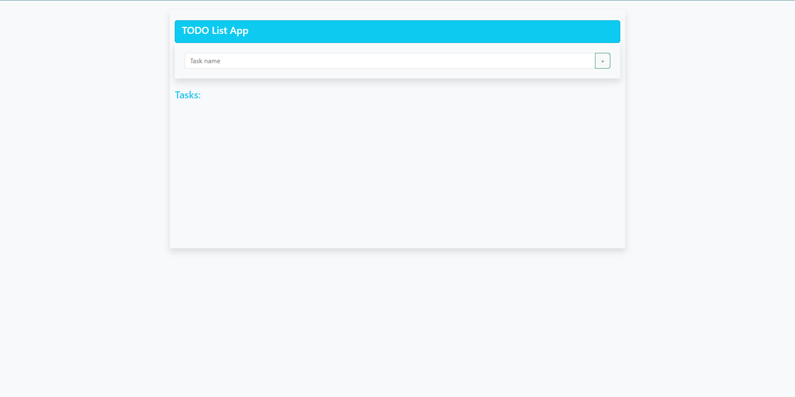
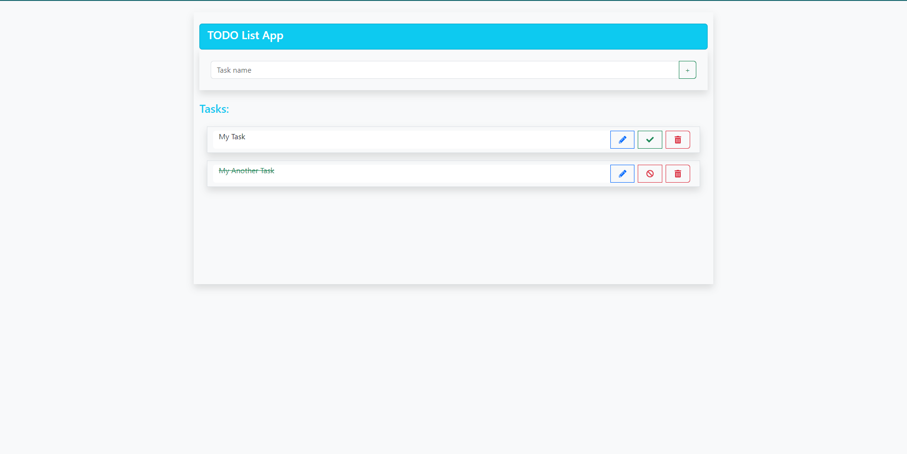
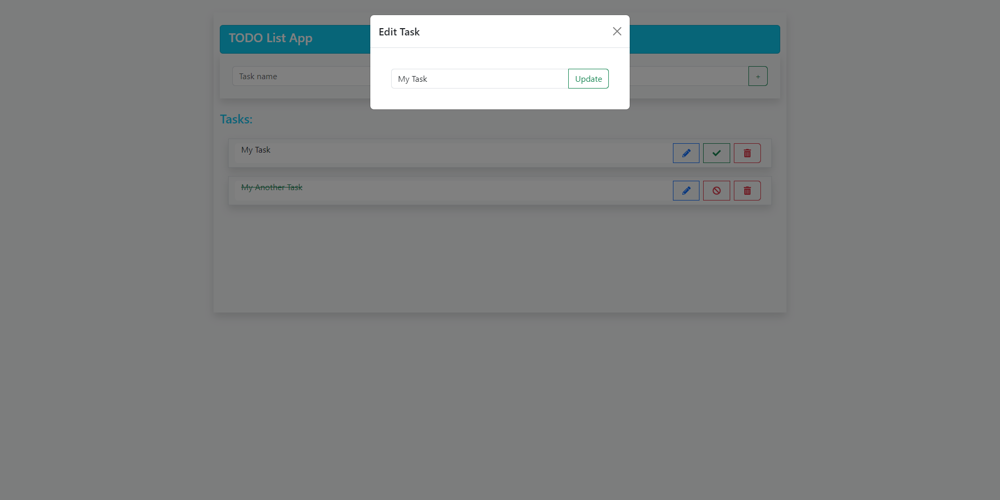
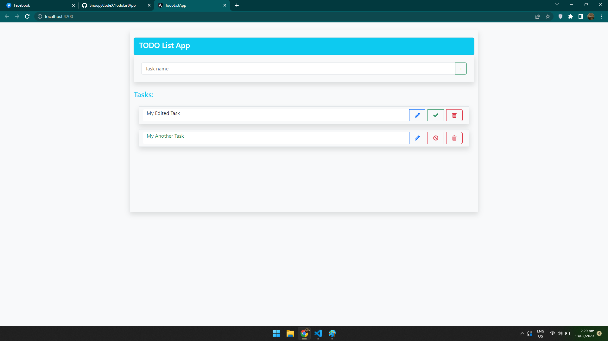

# TodoListApp

This project is a simple Todo List App made using AngularJS and Bootstrap CSS.

## Project Preview
| **Preview 1** | **Preview 2** |
|---------------|---------------|
|  |  |
| **Preview 3** | **Preview 4** |
|  |  |

## Development server

Before running the app, please start the Json-Server first by typing `json-server --watch db.json`.

Run `ng serve` for a dev server. Navigate to `http://localhost:4200/`. The application will automatically reload if you change any of the source files.

## Build

Run `ng build` to build the project. The build artifacts will be stored in the `dist/` directory.

## Running unit tests

Run `ng test` to execute the unit tests via [Karma](https://karma-runner.github.io).

## Running end-to-end tests

Run `ng e2e` to execute the end-to-end tests via a platform of your choice. To use this command, you need to first add a package that implements end-to-end testing capabilities.

## Further help

To get more help on the Angular CLI use `ng help` or go check out the [Angular CLI Overview and Command Reference](https://angular.io/cli) page.
